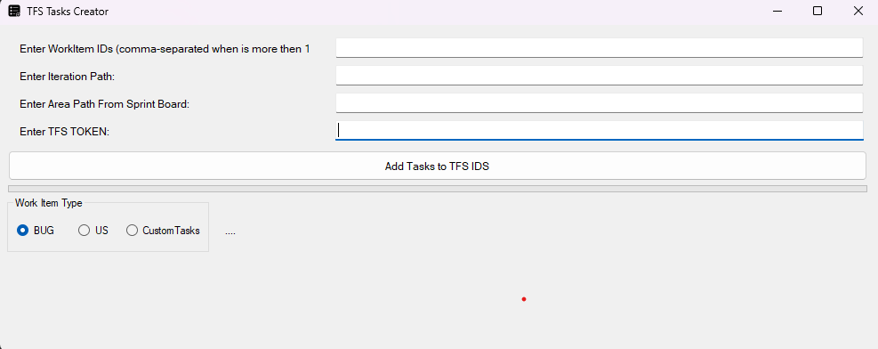

# TFSTaskCreator

This build was created task creating on team foundation server, it allows you to create predefined tasks in a json file, and assign them to multiple tfs workitems.

<center></center>

### Objective
This application is designed to streamline the creation of tasks across multiple work items simultaneously. It allows for customization of the following parameters:

- Task titles

- Descriptions

- Assignment of responsible users

- Modification of activity types

- Definition of original estimates and remaining work

### Configuration and Usage

To configure the required values for task creation and to establish a connection with TFS, a JSON configuration file must be used. This file should contain the following information:

#### Personal Access Token (PAT):
This token must be generated from your TFS account with permissions to read, write, and update work items. It should be included in the JSON file under the property "Token" as shown below:
```json
  {
    "Token": ""
  }
```

Alternatively, the token can be entered directly into the application's graphical user interface.

#### Tfs Url and Project Name

You must change tfs url for the collection url your using like in the following example, and then set the project name on json file to that is inside your collection.

```json
 "AppConfig": [
          {
            "ProjectName": "", // tfs project Name example: http://tfs.link.com/tfs/DefaultCollection/{ProjectName} you should only set the project name not the url.
            "TfsUrl": "", // tfs main project Url example: http://tfs.link.com/tfs/DefaultCollection/
```

## Task Customization
The application supports the customization and management of tasks through three categories of work items, each corresponding to a specific radio button selection:

### Flexible Task Management
Each category allows for complete flexibility in task definition. You can add or remove tasks as needed, tailoring the task list to match the scope and requirements of your work item. This adaptability makes it easy to scale your task set up or down based on the complexity and context of the item being worked on.

1. bug_tasks
Associated Radio Button: BUG
This category is used to define tasks related to bug work items.

2. us_tasks
Associated Radio Button: US
This category defines tasks related to user stories.

3. custom_tasks
Associated Radio Button: Custom Tasks
This category allows for freely defined tasks that may not fall under standard bug or user story categories.


**Example Task:**

- Title: Code Review
- Description: Code Review
- Activity: Requirements
- Original Estimate: 1
- Remaining Work: 1
- Assigned To: (Specify user here)

(Additional tasks can be defined as needed.)

## Json File Structure

```json
{
    "Tasks": {
        "AppConfig": [
            {
                "Token": "", // Add your personal token here
                "IterationPath": "", // Add the iteration path here normally it will be the path for you current created sprint.
                "AreaPath": "", 
            }
        ],

        "bug_tasks": [
            
            {
                "Title": "Análise & BugFix",
                "Description": "Development Correction",
                "Activity": "Development",
                "OriginalEstimate": "4",
                "RemainingWork": "4",
                "AssignedTo": "(Specify user here)"
            },
            {
                "Title": "QA: Possible FeedBack and Fix",
                "Description": "Rejected by QA or Product - NEED FIX",
                "Activity": "Development",
                "OriginalEstimate": "2",
                "RemainingWork": "2",
                "AssignedTo": "(Specify user here)"
            },
            {
                "Title": "Merge Angular",
                "Description": "Complete merge",
                "Activity": "Deployment",
                "OriginalEstimate": "1",
                "RemainingWork": "1",
                "AssignedTo": "(Specify user here)"

            },
            {
                "Title": "Doc Release",
                "Description": "Doc Release",
                "Activity": "Documentation",
                "OriginalEstimate": "0,5",
                "RemainingWork": "0,5",
                "AssignedTo": "(Specify user here)"
            },
			
			
	
        ],
        "us_tasks": [
            {
                "Title": "Code Review",
                "Description": "Code Review",
                "Activity": "Requirements",
                "OriginalEstimate": "1",
                "RemainingWork": "1",
                "AssignedTo": "(Specify user here)"
            },
            {
                "Title": "Análise & Desenvolvimento",
                "Description": "Desenvolvimento",
                "Activity": "Development",
                "OriginalEstimate": "16",
                "RemainingWork": "16",
                "AssignedTo": ""
            },
            {
                "Title": "QA: Possible FeedBack and Fix",
                "Description": "Rejected by QA or Product - NEED FIX",
                "Activity": "Development",
                "OriginalEstimate": "4",
                "RemainingWork": "4",
                "AssignedTo": "(Specify user here)"
            },
            {
                "Title": "Merge",
                "Description": "Complete merge",
                "Activity": "Deployment",
                "OriginalEstimate": "1",
                "RemainingWork": "1",
                "AssignedTo": "(Specify user here)"

            },
            {
                "Title": "Doc Release",
                "Description": "Doc Release",
                "Activity": "Documentation",
                "OriginalEstimate": "0,5",
                "RemainingWork": "0,5",
                "AssignedTo": "(Specify user here)"
            },
			{
                "Title": "Testes Funcionais",
                "Description": "Testes Funcionais",
                "Activity": "Development",
                "OriginalEstimate": "2",
                "RemainingWork": "2",
                "AssignedTo": "(Specify user here)"
            },
			{
                "Title": "Testes Unitários",
                "Description": "Testes Unitários",
                "Activity": "Development",
                "OriginalEstimate": "3",
                "RemainingWork": "3",
                "AssignedTo": "(Specify user here)"
            },
					{
                "Title": "Produto: Possible FeedBack and Fix",
                "Description": "Rejected by QA or Product - NEED FIX",
                "Activity": "Development",
                "OriginalEstimate": "4",
                "RemainingWork": "4",
                "AssignedTo": "(Specify user here)"
            },
			
          
        ],
        "custom_tasks": [
            {
                "Title": "Testes QA",
                "Description": "Testes QA",
                "Activity": "Testing",
                "OriginalEstimate": "2",
                "RemainingWork": "2",
                "AssignedTo": "(Specify user here)"
            }
        ]
    }
}
```
